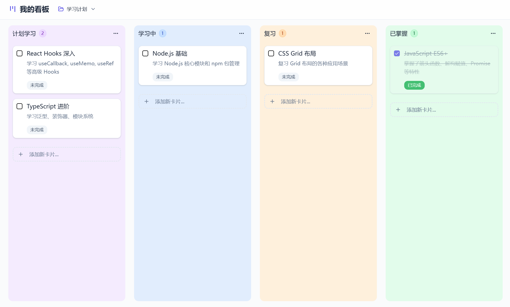

<div align="center">

# 船长待办 · Captain Todo

一个本地优先的桌面看板：按项目分列，拖一拖就排好，数据只存在你自己电脑上。

简体中文 · [English](README.en.md)

</div>



## 这是什么

事情一多，待办清单就不够用了：要分项目，要分“没开始、在做、做完”，要能随手拖着改顺序，还不想把这些记录交给某个云服务。船长待办就是为这个做的小工具。

- 可以建好几个项目，一键切换，每个项目一块自己的看板。
- 看板的列随便加、改名、换颜色。
- 卡片记标题、描述、优先级、日期和是否完成，在同一列里或者跨列拖动都行。
- 数据写进本机的 SQLite 数据库，不联网、不注册账号。

想先看看长什么样，可以打开 [在线体验](https://heihuzicity-todo.figma.site/)。

## 装起来

需要 Node.js 18 以上；要跑或打包桌面版，还需要 Rust 1.85 以上。

```bash
npm install
npm run tauri:dev      # 桌面版，开发模式
npm run tauri:build    # 打出桌面安装包
```

只想在浏览器里看界面，可以 `npm run dev`，默认在 `http://localhost:5173`。

## 开发

界面用 React 和 TypeScript 写，打包成桌面应用靠 Tauri 2，数据存取在 Rust 那一侧完成。

```text
src/          React 界面：看板、卡片、项目切换、状态 Hooks
src-tauri/    Rust 后端：Tauri 命令、SQLite 建表、迁移和读写
docs/         项目说明
```

架构、数据流和维护约定见 [项目说明](docs/项目说明.md)。

## 许可证

[MIT](LICENSE)。

---

<sub>船长系列，来自 [heihuzi-labs](https://github.com/heihuzi-labs)：[船长派活](https://github.com/heihuzi-labs/captain-crew) · [船长 K8s](https://github.com/heihuzi-labs/captain-kube) · [船长运维](https://github.com/heihuzi-labs/captain-ops) · **船长待办**</sub>
